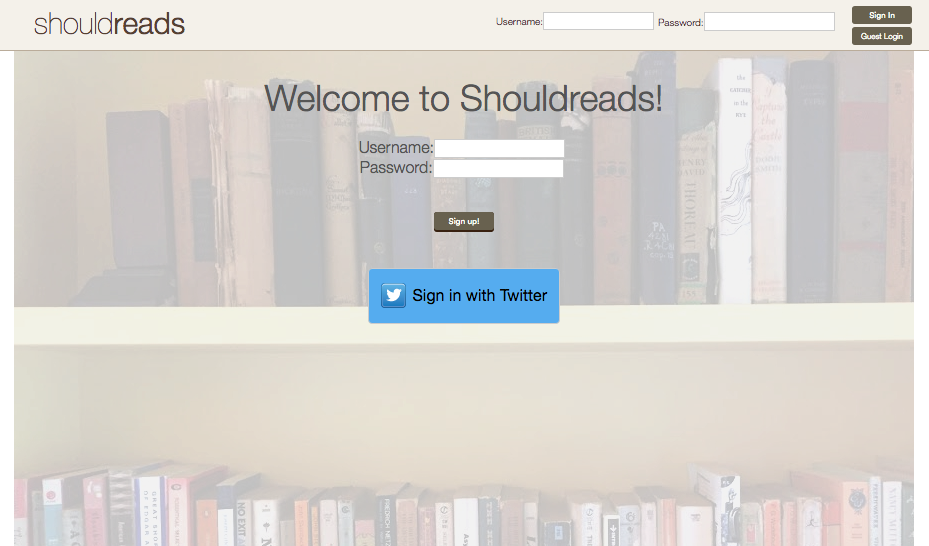
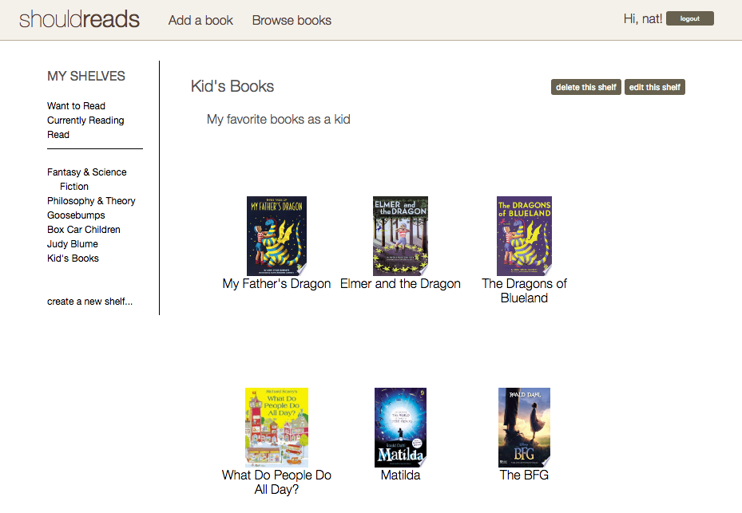

# ShouldReads

ShouldReads is a web application for organizing and discovering your favorite new
books. It was inspired by GoodReads and built using Ruby on Rails, React.js and Flux,
and integrates the Google Books API to populate the database.

Check it out at http://should-reads.herokuapp.com

### Login View:

### Home View:

### Technical Details:

* ShouldReads allows for organization of your favorite books, using the Google books
API to seed the database with any information not provided by the user.

### Features:

* Organization of books by user-created shelf
* Organization of books into three factory-made statuses, "Read", "Want to Read",
& "Currently Reading"

### Languages:

* JavaScript
* Ruby
* SQL
* HTML
* CSS

# Frameworks:

* React.js
* Rails

### Libraries and Technologies:

* Google Books API
* BCrypt
* Flux
* jQuery
* Paperclip
* PostgreSQL
* Twitter OmniAuth
* React Router
* Webpack

### To-Do:

[ ] Flashier, cleaner CSS
[ ] Book reviews & ratings
[ ] Genre tags
[ ] User community, profiles and user-uploaded profile pictures
[ ] Pagination with Kaminari
[ ] Auto-focus for forms
[ ] Google & Facebook OmniAuth
